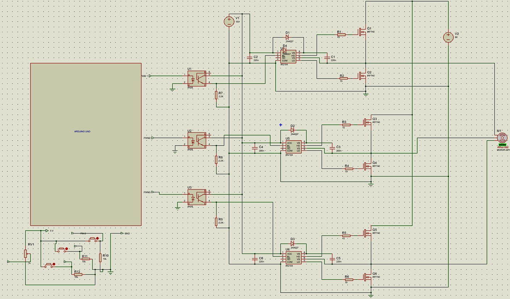
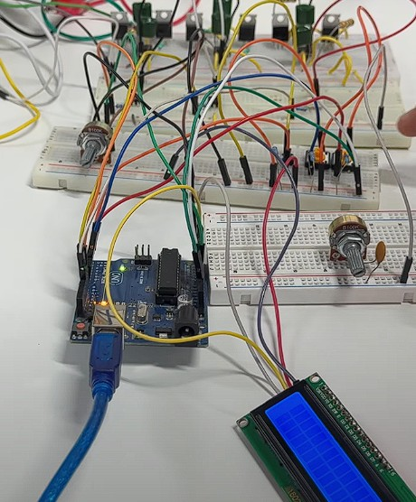
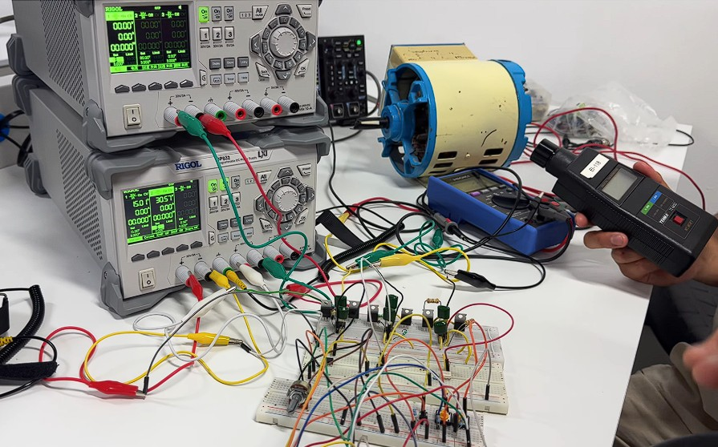
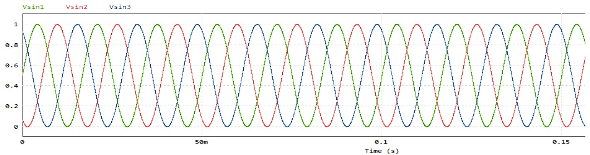

# Three-Phase Induction Motor Speed Control (V/f Constant)

Design and physical implementation of a variable-frequency drive (VFD) for a three-phase induction motor using the constant V/f technique. An Arduino Uno generates three-phase SPWM signals (120° phase shift) to control a three-phase MOSFET inverter, enabling smooth speed control, soft start/stop ramps, direction reversal, and real-time RPM display on an LCD.

🎥 [Watch demo video](https://youtu.be/f5F9aFX-HZ0?si=eO6sXRoskCcAvkKH)

---

## System Overview

```
Potentiometer → Arduino Uno (SPWM generation)
                     ↓
              4N28 Optocouplers (galvanic isolation: 5V → 15V)
                     ↓
              IR2111 Gate Drivers (signal amplification to 16V)
                     ↓
              IRF740 MOSFETs (3-phase H-bridge inverter)
                     ↓
              Three-phase induction motor (30–60 VDC bus)
                     ↓
              LCD 16x2 I2C → RPM, frequency, direction (FWD/BCK)
```

---

## Features

- **Constant V/f control** — frequency and voltage modulated proportionally to maintain constant magnetic flux across the full speed range
- **SPWM generation** — 167-sample sine lookup table, 3 phases at 120° electrical offset, output on Arduino pins 9, 10, 11
- **Soft start ramp** — amplitude increases gradually from 0 to target to prevent current spikes and mechanical stress
- **Soft stop ramp** — gradual amplitude reduction to zero before full shutdown
- **Direction reversal** — phases B and C swapped to invert rotating magnetic field, with automatic brake ramp before switching
- **Real-time LCD display** — RPM, frequency (Hz), and direction (FWD/BCK) updated every 500 ms via I2C

---

## Hardware

### Power Electronics

| Component | Qty | Role |
|---|---|---|
| MOSFET IRF740 | 6 | Three-phase bridge inverter (2 per phase) |
| Gate driver IR2111 | 3 | Half-bridge control, bootstrap high-side drive |
| Optocoupler 4N28 | 3 | Galvanic isolation between Arduino (5V) and power stage (15V) |
| Diode 1N4001 | 6 | Freewheeling / reverse voltage protection |

### Passive Components

| Component | Value | Role |
|---|---|---|
| Capacitors | 220 nF | Decoupling and bootstrap |
| Resistors | 2.2 kΩ | Current limiting on driver inputs |
| Resistors | 15 Ω | IRF740 gate resistors |
| Resistors | 330 Ω | Arduino pull-down configuration |

### Control & Interface

| Component | Specification |
|---|---|
| Microcontroller | Arduino Uno (ATmega328P) |
| Speed input | 10 kΩ potentiometer → analog pin A0 |
| Push buttons | 3× — Start (pin 3), Stop (pin 4), Direction change (pin 2) |
| Display | LCD 16x2 with I2C module (address 0x27) |

### Power Supplies

| Supply | Voltage | Powers |
|---|---|---|
| Control logic | 15 VDC | IR2111 drivers + optocouplers |
| Power stage | 30–60 VDC | MOSFET inverter → motor |

---

## V/f Control Implementation

The potentiometer (A0) simultaneously controls two parameters to maintain a constant V/f ratio:

| Parameter | Min | Max | Controls |
|---|---|---|---|
| `delayPorPaso` | 5000 µs | 20 µs | Sine table step delay → frequency (1–60 Hz) |
| `amplitudPWM` | 4 | 255 | PWM amplitude → voltage (0–60 V) |

**RPM estimation formula:**
```
RPM = frequency_Hz × (350.0 / 60.0)
```

**Sine table:**  167 samples, values scaled 0–255, pre-loaded at startup:
```cpp
sineTable[i] = (uint8_t)((sin(2 * PI * i / numSamples) + 1) * 127.5);
```

---

## Measured Results

| Measurement | Value |
|---|---|
| Arduino PWM output (peak-to-peak) | ~5.53 V |
| IR2111 gate drive output | up to 16.2 V |
| Phase shift between outputs | 120° (verified on oscilloscope) |
| Operating frequency range | 1–60 Hz |
| Operating voltage range | 0–60 V |
| LCD display example | RPM: 344 · F: 59 Hz · FWD |

---

## PSIM Simulation

The circuit was pre-validated in PSIM using three sinusoidal voltage sources (Vsin1, Vsin2, Vsin3) with 120° offset driving comparators that generate PWM signals for a 6-switch MOSFET bridge. The simulation confirmed progressive motor acceleration and stable rotating magnetic field generation from a 30 VDC bus.

---

## Photos

| | |
|---|---|
|  |  |
|  |  |

---

## Files

```
three-phase-motor-vf-control/
├── arduino/
│   └── (Arduino .ino sketch)
├── docs/
│   └── Proyecto_Electronica_de_Potencia.pdf
├── images/
└── README.md
```

### Requirements to run the code

- Arduino IDE
- Libraries: `Wire.h`, `LiquidCrystal_I2C.h`
- Hardware: Arduino Uno, IR2111 drivers, IRF740 MOSFETs, 4N28 optocouplers, LCD 16x2 I2C
- Power: 15 VDC (logic) + 30–60 VDC (motor stage)

---

## Authors

**Alonso Lopez Hernandez** — [GitHub](https://github.com/AlonsoLohe) · [LinkedIn](https://www.linkedin.com/in/alonso-lópez-hernández-10335716a)

**Collaborators:**
- Victor Alfonso Cuatepotzo Cuatepotzo
- Jaime Hernández Zapata
- Raul Jimenez Alanis
- Erik Duarte Blanco

*UPAEP — Power Electronics (MEC223) · 2025*
